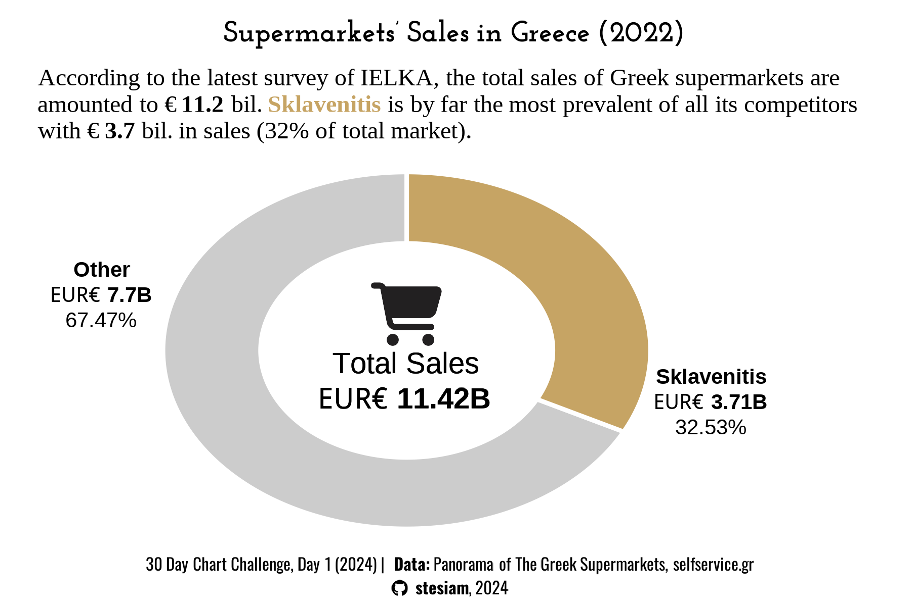
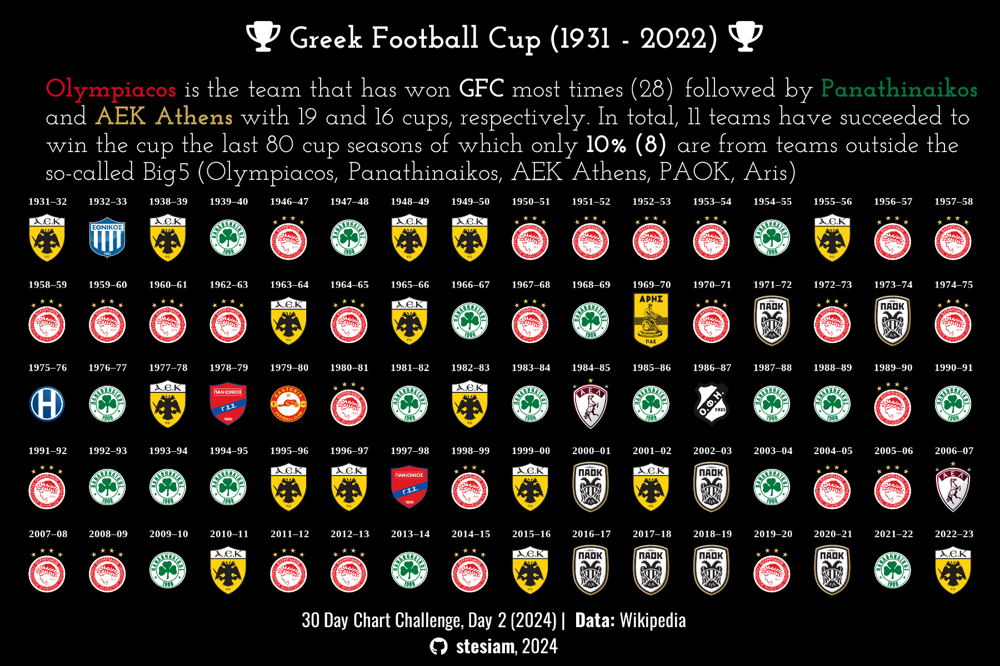

# 30 Day Chart Challenge

My visualizations for **30DCC**. This is my first year participating on this challenge and I feel so happy with the plots I have already made. I decided my plots on 30DCC of 2024 have an unofficial theme specifically with Greece and some other topics that I am concerned about. I hope to like my visualizations. In such a case I would appreciate if you star my repository, as it gives me motivation to go on my journey with R. :)

  

## A short overview of my 30DCC - 2024

| **Day**  | **Base Geometry** | **Fonts** | **Visualization** | 
| :-------------: | :---:| :---: |:-------------: |
| **`Day 1`**   **`Part-to-Whole`** |    *geom_arc_bar()*   [ggforce](https://ggforce.data-imaginist.com/index.html)| [Josefin Slab](https://fonts.google.com/specimen/Josefin+Slab)    [Oswald](https://fonts.google.com/specimen/Oswald) |  |
| **`Day 4`**   **`Waffle`**  | *geom_image()*   [ggimage](https://github.com/GuangchuangYu/ggimage) | [Josefin Slab](https://fonts.google.com/specimen/Josefin+Slab)| |
| **`Day 15`**   **`Historical`**| *geom_stream()*   [ggstream](https://github.com/davidsjoberg/ggstream)| [Jost](https://fonts.google.com/specimen/Jost)    [Oswald](https://fonts.google.com/specimen/Oswald)   [Ubuntu Condensed](https://fonts.google.com/specimen/Ubuntu+Condensed) | |
