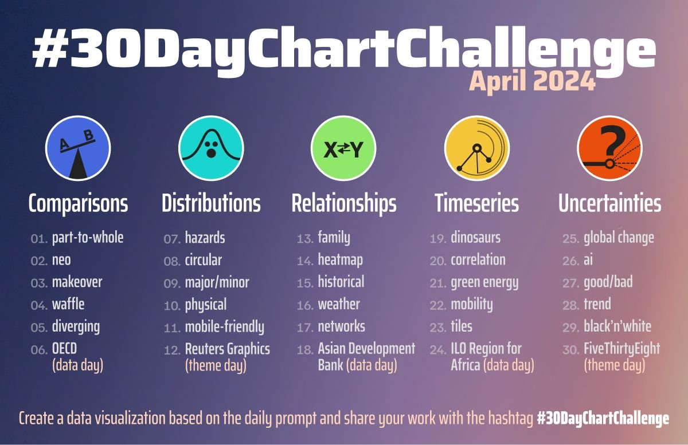
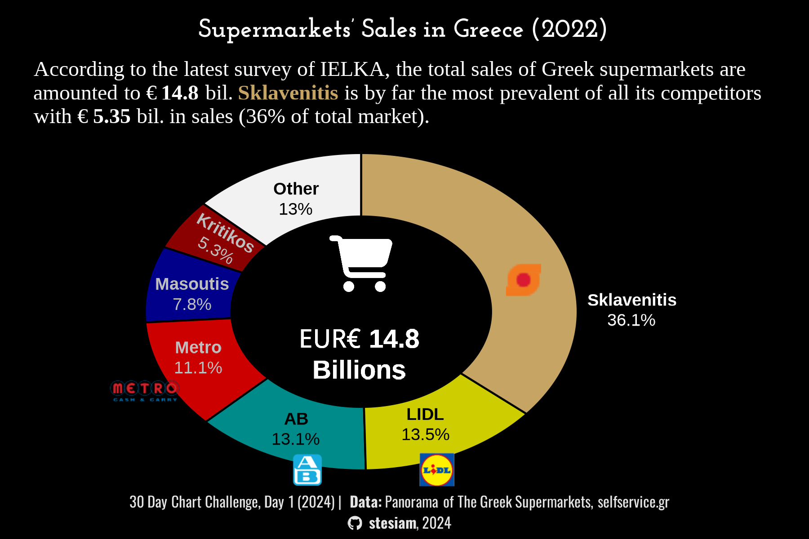
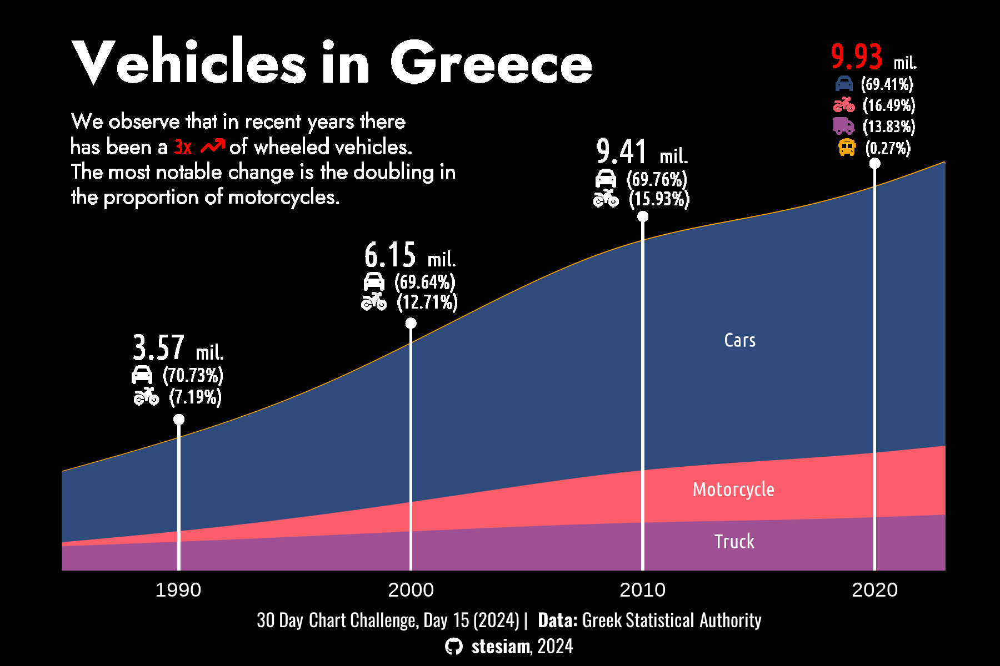
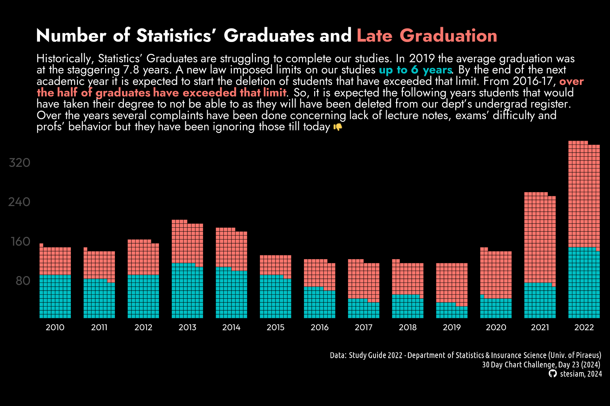
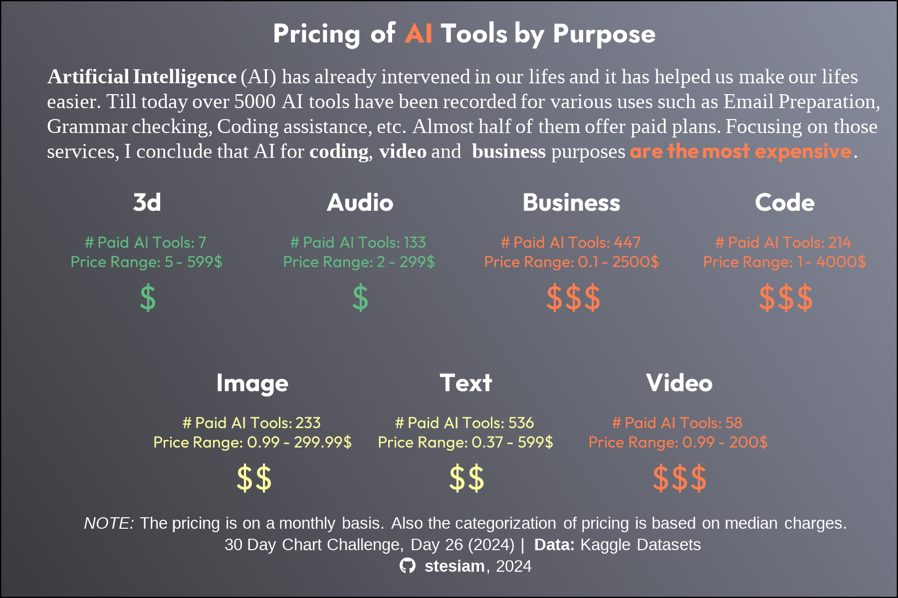
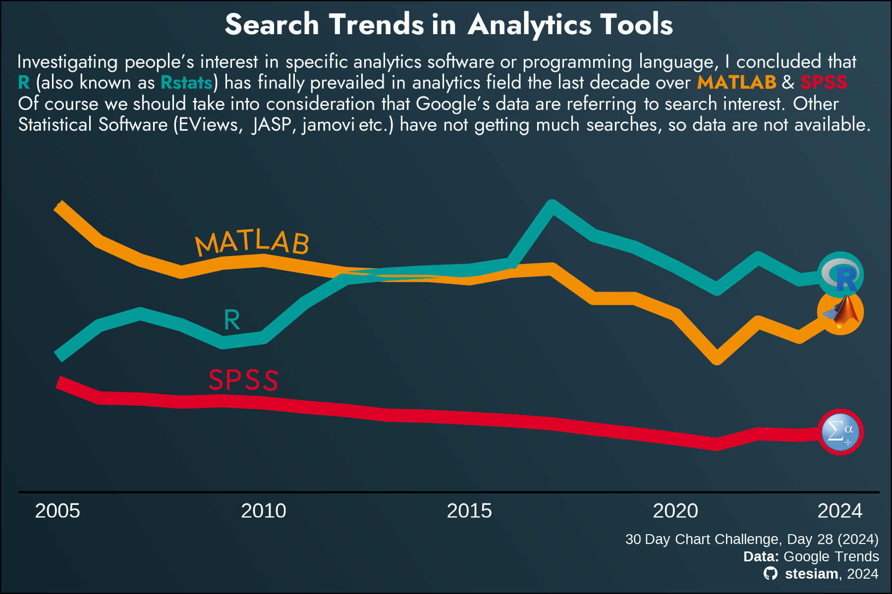

# 30 Day Chart Challenge

My visualizations for **30DCC**. This is my first year participating on this challenge and I feel so happy with the plots I have already made. I decided my plots on 30DCC of 2024 have an unofficial theme specifically with Greece and some other topics that I am concerned about. I hope to like my visualizations. In such a case I would appreciate if you star my repository, as it gives me motivation to go on my journey with R. :)

  

## A short overview of my 30DCC - 2024

### **1. Part-to-Whole**

**Date:** `Day 1`  
**Geometry:** *geom_arc_bar()* ([ggforce](https://ggforce.data-imaginist.com/index.html)) 
**Source:** --  

### **2. Waffle**

**Date:** `Day 4`  
**Geometry:** *geom_image()* ([ggimage](https://github.com/GuangchuangYu/ggimage)) 
**Source:** --  

### **3. Historical**

**Date:** `Day 15`  
**Geometry:** *geom_stream()* ([ggstream](https://github.com/davidsjoberg/ggstream)) 
**Source:** --  

### **4. Tiles**

**Date:** `Day 23`  
**Geometry:** *geom_waffle()* ([waffle](https://github.com/hrbrmstr/waffle)) 
**Source:** --  

### **5. AI**

**Date:** `Day 26`  
**Geometry:** *geom_waffle()* ([waffle](https://github.com/hrbrmstr/waffle)) & *facet_manual()* ([ggh4x](https://teunbrand.github.io/ggh4x/)) 
**Source:** --  

### **6. Trend**

**Date:** `Day 28`  
**Geometry:** *geom_image()* ([ggimage](https://github.com/GuangchuangYu/ggimage)) 
**Source:** --  

